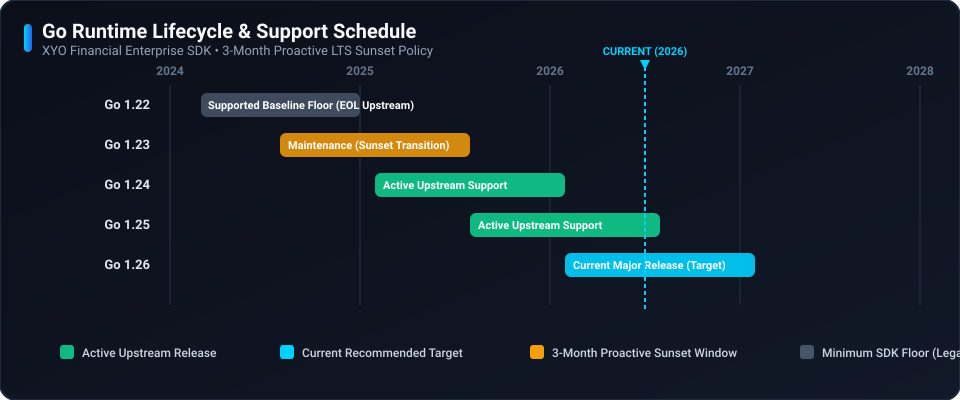

# 🛡️ Security Policy

## 📋 Supported Versions

Only the current major release line of the XYO Go SDK receives active security updates and patches.

| Version | Supported | End of Security Support |
| ------- | --------- | ----------------------- |
| 2.x     | :white_check_mark: | Active                  |
| < 2.0.0 | :x:                | End of Life (EOL)       |

## ⚙️ Runtime Lifecycle & LTS Support Policy

### Policy Guarantee
XYO Financial strictly adheres to the official Go upstream release policy (which maintains the two most recent major releases). 

- **Minimum Baseline Floor:** We guarantee compatibility with our minimum stated runtime version (**Go 1.22+**).
- **3-Month Proactive Window:** We proactively update our SDK baseline, notify enterprise integrators, and publish upgraded releases **3 months before** an active runtime version loses upstream maintenance or reaches End-of-Life (EOL).

| Go Version | Status | Upstream Release | Upstream EOL | SDK Support Status |
| :--- | :--- | :--- | :--- | :--- |
| **Go 1.26** | :white_check_mark: Active | Feb 2026 | Feb 2027 | **Current Recommended Target** |
| **Go 1.25** | :white_check_mark: Active | Aug 2025 | Aug 2026 | Fully Supported |
| **Go 1.24** | :white_check_mark: Active | Feb 2025 | Feb 2026 | Fully Supported |
| **Go 1.23** | :lock: Sunset Window | Aug 2024 | Aug 2025 | Supported (Upgrade Recommended) |
| **Go 1.22** | :warning: Hard Floor | Feb 2024 | Feb 2025 | **Minimum Baseline Floor** |
| **<= 1.21** | :x: EOL | <= Aug 2023 | Dead | **Unsupported / Insecure** |

## 🚨 Reporting a Vulnerability

If you discover a potential security vulnerability in this SDK, please do not report it publicly through a GitHub issue. Instead, report it privately:

- **Email:** security@syniol.com
- **Response Time:** We will acknowledge receipt of your vulnerability report within 48 hours and provide a detailed response on next steps within 5 business days.
